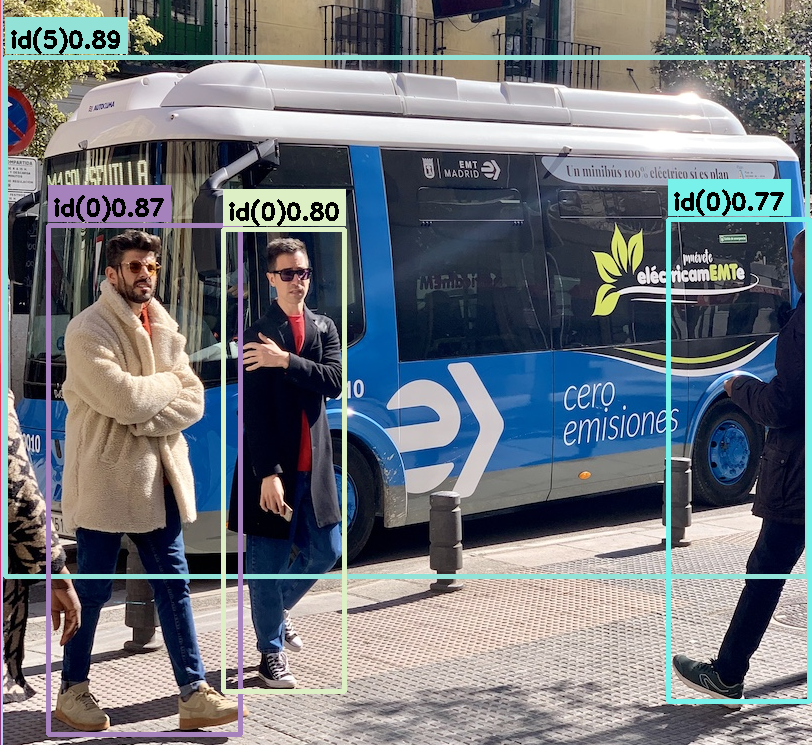
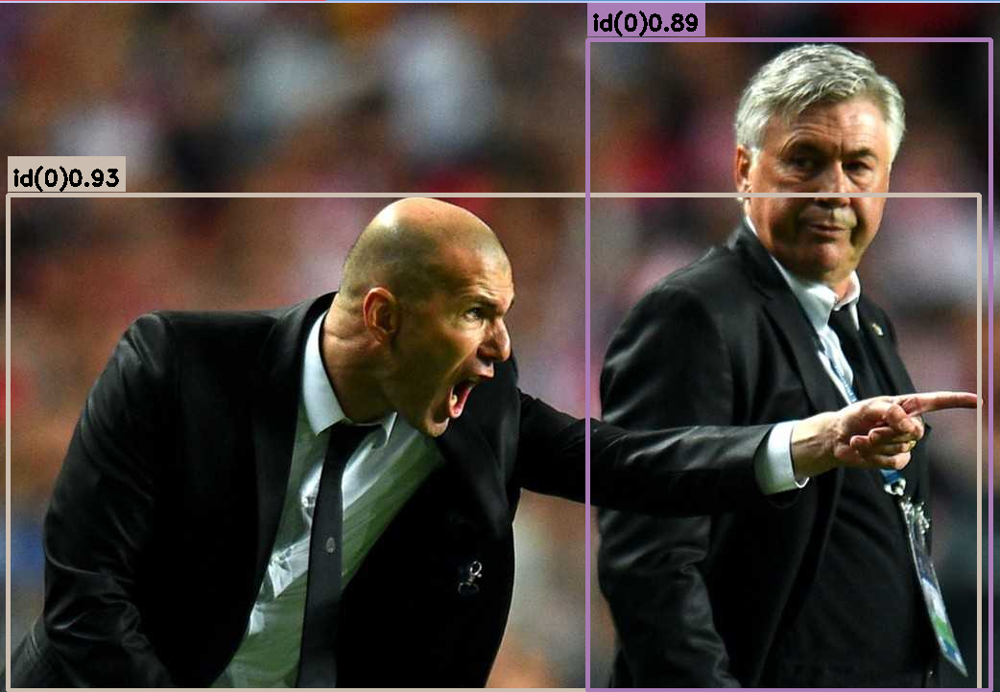

# YOLOv10 OpenVINO Inference C++
Implementing YOLOv10 object detection using OpenVINO for efficient and accurate real-time inference.

## Dependencies
| Dependency | Version  |
| ---------- | -------- |
| OpenVINO   | >=2023.3   |
| OpenCV     | >=4.5.0  |
| C++        | >=14     |
| CMake      | >=3.12.0 |

## Model Conversion Resources
- [Docs by Ultralytics](https://docs.ultralytics.com/integrations/openvino/#usage-examples)
- [Supported models by OpenVINO](https://docs.openvino.ai/2023.3/openvino_docs_OV_UG_Integrate_OV_with_your_application.html)
- [YOLOv10 exporter](YOLOv10_exporter.ipynb)

## Install Dependencies
```bash
apt-get update
apt-get install -y \
    libtbb2 \
    cmake \
    wget \
    libopencv-dev \
    pkg-config \
    g++ \
    gcc \
    libc6-dev \
    make \
    build-essential \
    sudo \
    ocl-icd-libopencl1 \
    python3 \
    python3-venv \
    python3-pip \
    libpython3.8
```
## Install OpenVINO
You can download another version of OpenVINO at this [link](https://storage.openvinotoolkit.org/repositories/openvino/packages/2023.3/linux).
```bash
wget -O openvino.tgz https://storage.openvinotoolkit.org/repositories/openvino/packages/2023.3/linux/l_openvino_toolkit_ubuntu20_2023.3.0.13775.ceeafaf64f3_x86_64.tgz && \

sudo mkdir /opt/intel
sudo mv openvino.tgz /opt/intel/

cd /opt/intel

sudo tar -xvf openvino.tgz
sudo rm openvino.tgz
sudo mv l_openvino* openvino
```

## Build 
```bash
git clone https://github.com/rlggyp/YOLOv10-OpenVINO-CPP-Inference.git
cd YOLOv10-OpenVINO-CPP-Inference/yolo

mkdir build
cd build
cmake ..
make

```
## Usage
```bash
# run this command if you are using an ONNX model format
./detect <model_path.onnx> <image_path> 

# run this command if you are using an OpenVINO model format
./detect <model_path.xml> <image_path> 
```



## Contributing
Contributions are welcome! If you have any suggestions, bug reports, or feature requests, please open an issue or submit a pull request.

## License
This project is licensed under the [MIT License](LICENSE). See the LICENSE file for details.
